# Confluence.
## Создала пространство для проекта в Confluence. Внесла следующие требования в Confluence. 
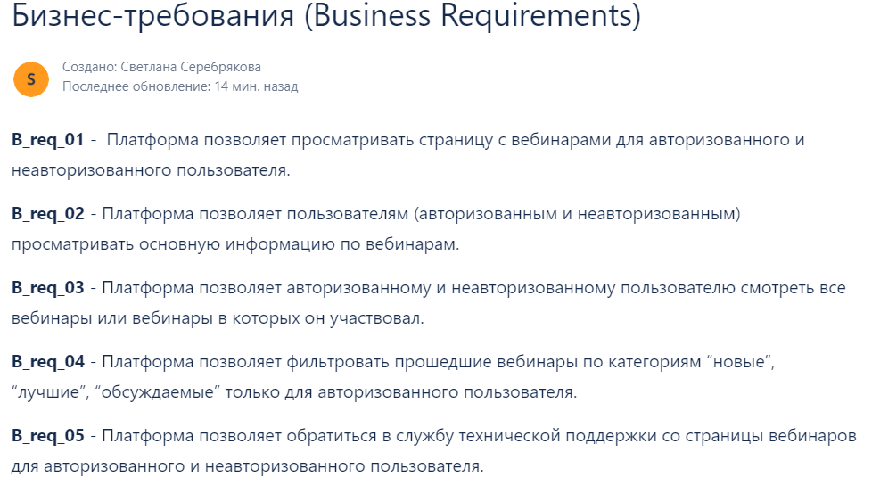

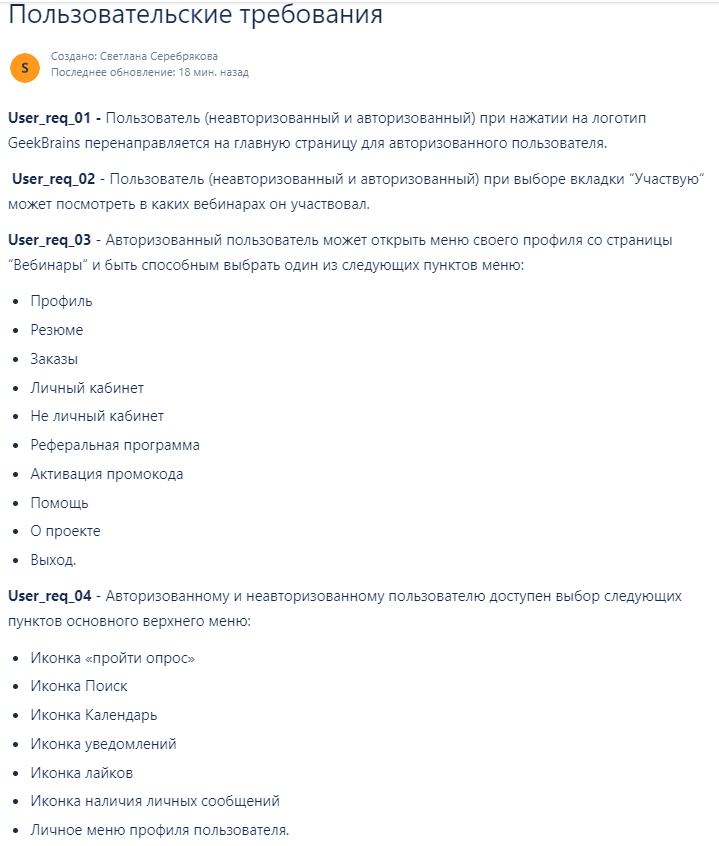

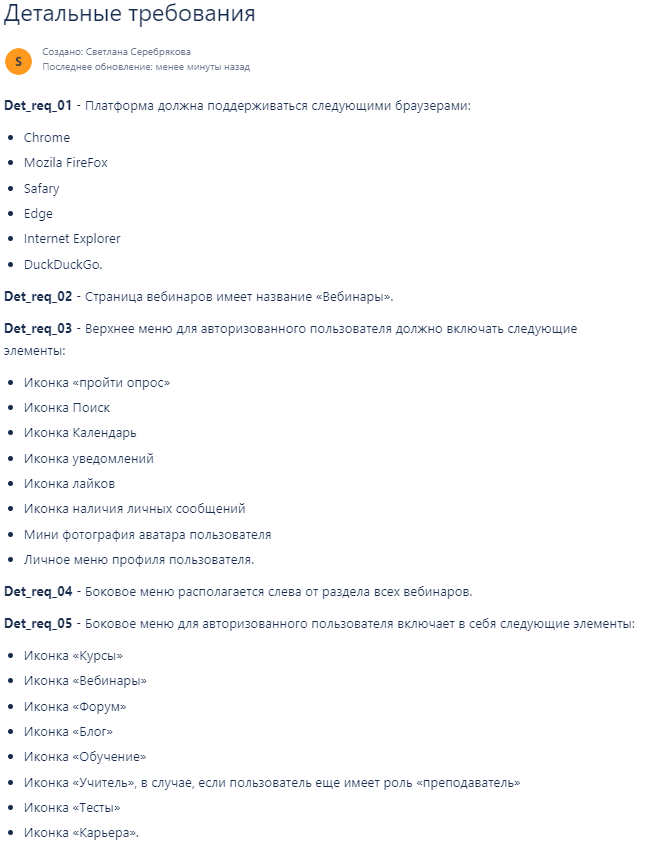

## Создала набор верхнеуровневых проверок (чек-лист) для неавторизованного пользователя.

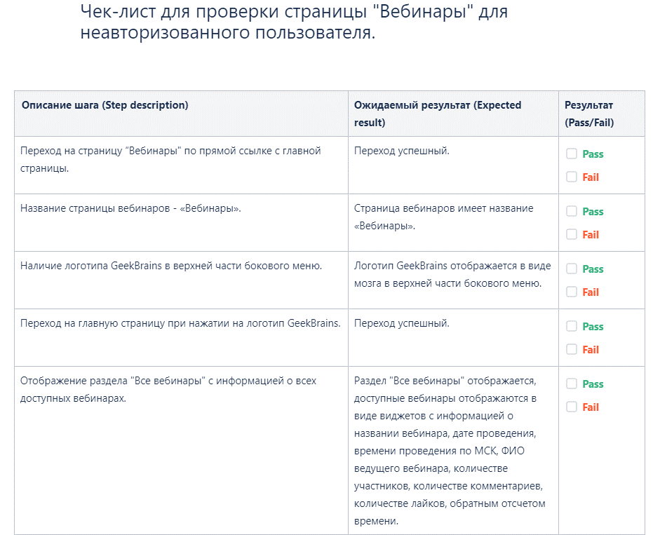
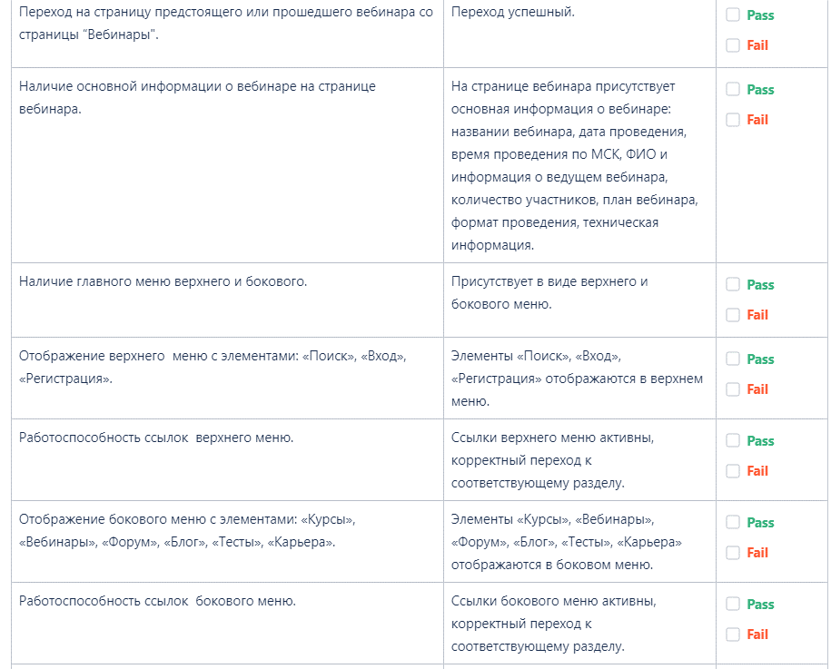

## Составила чит-лист для тестирования полей и форм.

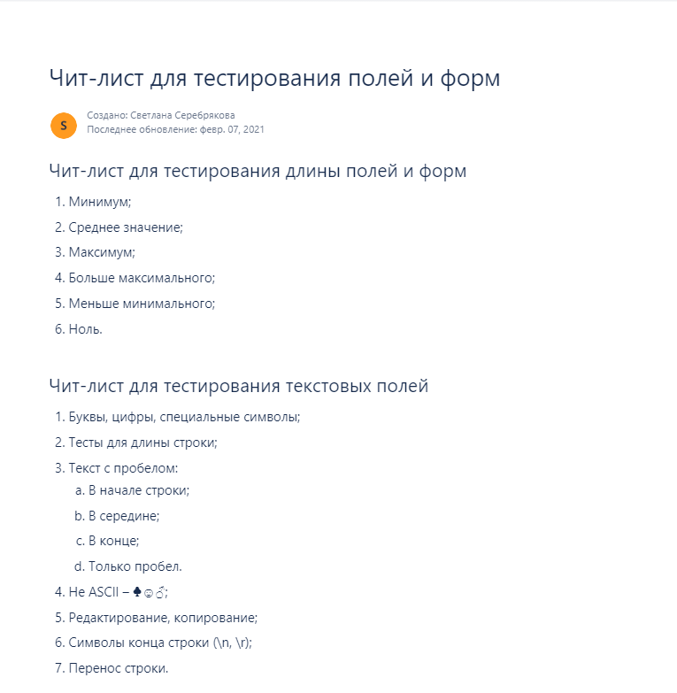
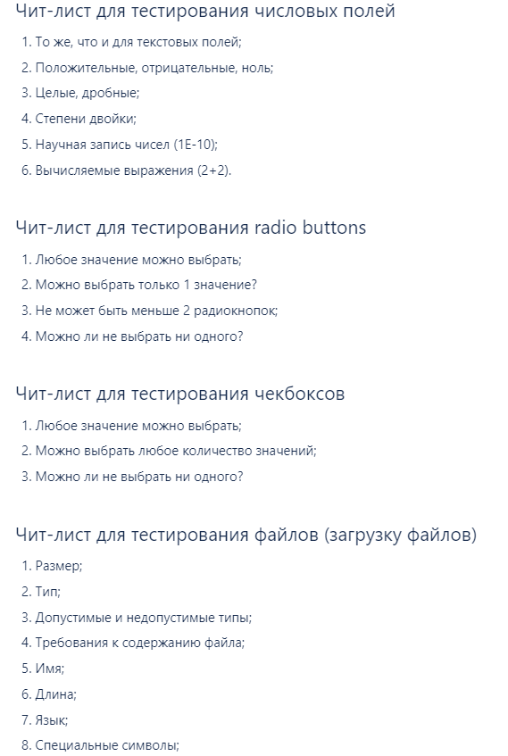
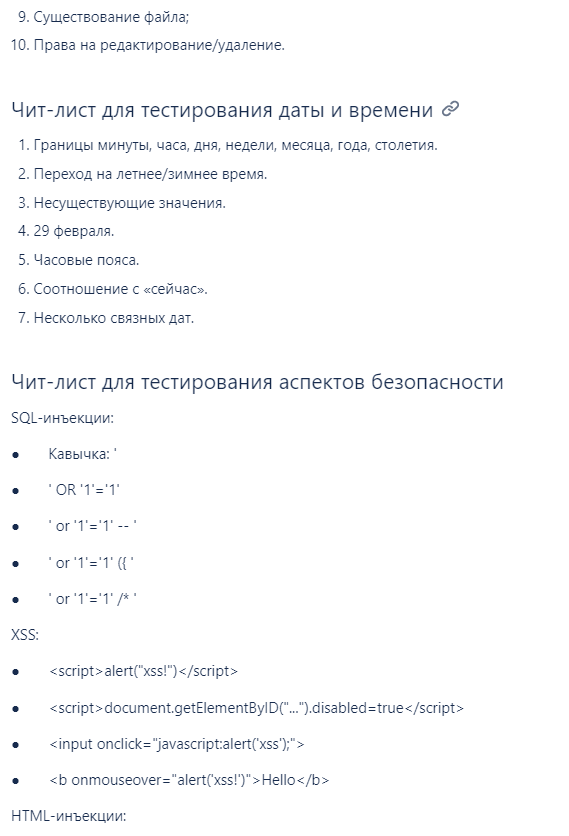
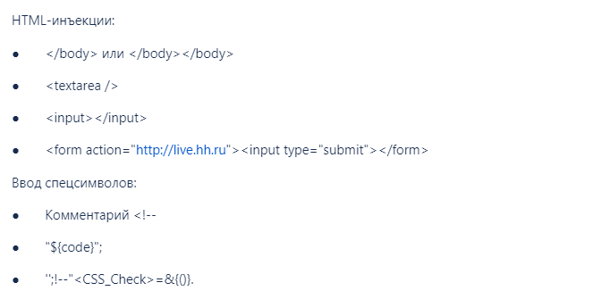

# TestIT
## Создала и внесла тест-кейсы в TestIT в проект.

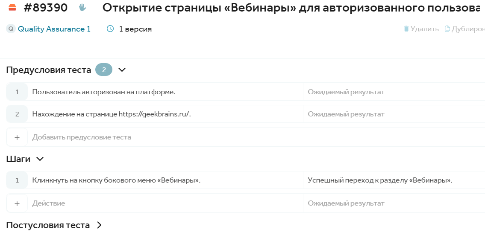

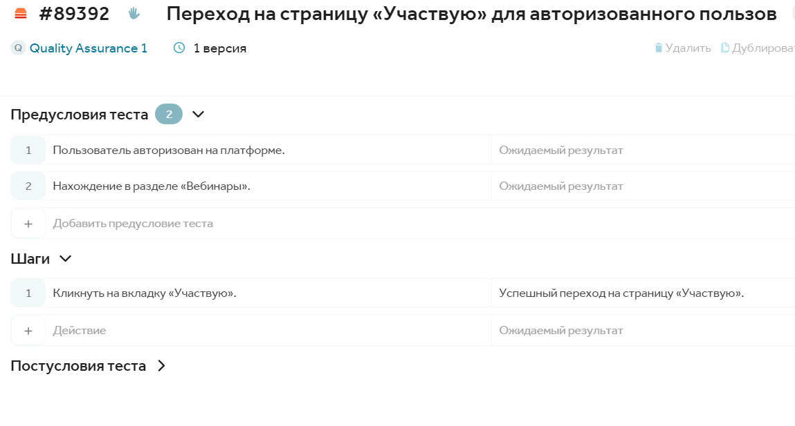

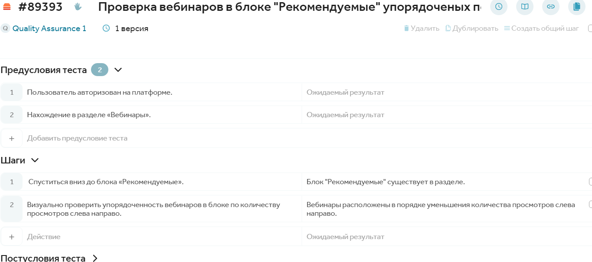

## Создала тест-план в TestIT и запустила все тест-кейсы.

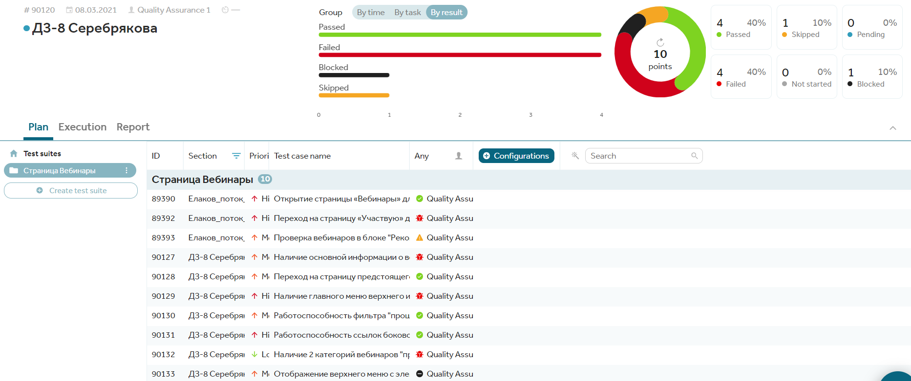